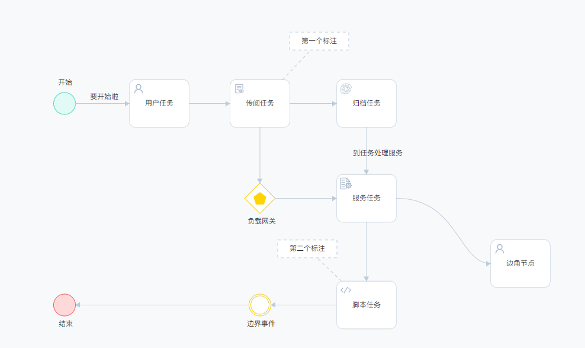
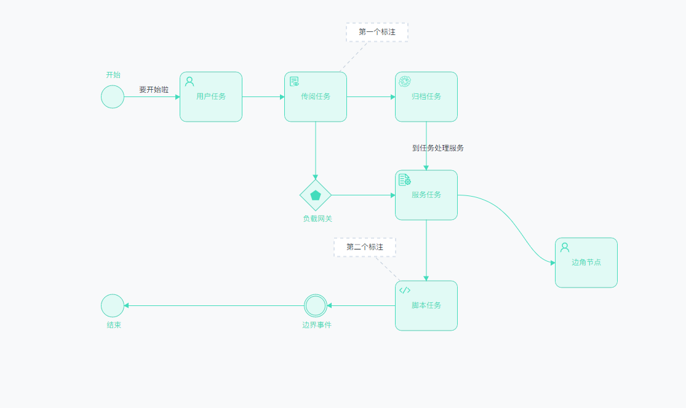

# bpmn-renderer bpmn 元素自定义渲染器

bpmn-renderer 为了解决 bpmn.js 样式修改比较麻烦的问题。插件将各个样式可修改项直接提供到配置项中，你只需要配置即可，并且自带了一套好看的默认样式。

## Document
[中文文档](./readme-zh.md)

[English document](./readme-zh.md)

## 支持

-   🎉 节点宽高: 宽度、高度
-   🎉 节点边框：边框颜色、边框粗细、边框圆角、阴影、阴影动画
-   🎉 节点背景：背景颜色
-   🎉 文字：文字颜色、文字大小、字体、位置
-   🎉 连接线：连接线颜色、线条粗细、箭头大小
-   🎉 图标：灵活的图标设置 

目前支持到的类型：用户任务、脚本任务、服务任务、文字注释、连接注释文字的虚线、文字标签、连接线、开始节点、结束节点、边界事件、网关

## 正在支持
 
-   🤔 更多的任务节点

## 效果预览

默认样式： 所有节点 will 状态下
 
默认样式： ing 状态下
 
默认样式： 所有节点 over 状态下
 

## 安装

    npm i bpmn-renderer

## 调用方法

    import Renderer from 'bpmn-renderer';

    new Viewer({
        // ...
        additionalModules: [ 
            Renderer({
                // 节点信息，可以给每个节点设置一个状态，不同的状态会采用不同的颜色
                // ing 状态下默认会有一个阴影动画
                nodesInfo:{
                    // 每个元素固定为如下配置， {  [元素ID]: {  status: "ing" } }
                    Gateway_0x3cmtw:{
                        // status: "ing", // "will" | "over" | "ing"
                    },
                },

                // 不同状态下的节点样式配置，默认采用内置的搭配
                // 在设计器（节点编辑页面）中不存在 ing 和 over 状态。
                style: {
                    will: {
                        node: {
                            backgroundColor: "red",
                        }
                    },
                    ing:{},
                    over:{}
                }

            }),
        ],
        moddleExtensions: {
            camunda: CamundaBpmnModdle,
            qnn: qnnBpmnModdle
        }
    });

## 样式配置

每个元素分为了三种状态，默认为 will 状态（编辑页面也可以采用这种状态）。

    {
        // 这里的快高设置不包括右键菜单中创建的节点宽高
        // 右键菜单中的节点宽高更改需要到 ContextPad 插件中完成
        base: {
            width: 100,
            height: 80,
        },
        will: {
            name: "未办理",
            // 节点
            node: {
                // 背景颜色
                backgroundColor: "#fff",
                // 边框颜色
                borderColor: "#dae2ec",
                // 边框圆角
                borderRadius: 10,
                // 边框粗细
                borderWidth: 2,
                // 节点文字颜色
                color: "#262c33",
                // color: "red",
                fontSize: 12,
                fontFamily: "苹方,微软雅黑",
				// textPosition: "bottom"
                // 阴影大小
                boxShadowSize: 0,

                /** 下面特殊设置的节点样式会优先采用 **/
                // 开始节点特殊样式
                'bpmn:StartEvent': {
                    backgroundColor: "rgb(225, 250, 245)",
                    borderColor: "rgb(67, 220, 188)",
                },
                // 结束节点特殊样式
                'bpmn:EndEvent': {
                    backgroundColor: "rgb(255, 217, 217)",
                    borderColor: "rgb(255, 79, 79)",
                },
                // 网关
                'bpmn:ExclusiveGateway': {
                    borderColor: "#FFD400",
                },
                // 边界事件
                'bpmn:IntermediateThrowEvent': {
                    borderColor: "#FFD400",
                }
            },
            // 节点连接线/箭头
            arrows: {
                // 线条粗细
                width: 1,
                backgroundColor: "#bfcbd9",
                // 转角连接类型  "L" 直线 | "C" 曲线,
                joinStyle: "C",
                // 箭头宽高， 必须为数字（单位 px）
                arrowsWidth: 12,
                arrowsHeight: 12,
            },

            // 图标
            icon: {
                width: 20,
                height: 20,
                color: "#a7b7cb",
                left: 5, top: 5,
				// center: true, 
                /**
                * 各个元素的svg图标
                * 必须返回 一个 '<svg>...</svg>' 字符串, 不能包含 DOCTYPE xml 这两标签
                */
                svgs: {
                    // 用户任务
                    'bpmn:UserTask': ({ element }) => {
                        const nodeType = element.businessObject["userTaskType"];
                        return {
                            "1": chuanyue,
                            "2": guidang
                        }[nodeType] || userIcon;
                    },
                    'bpmn:ScriptTask': ({ element }) => scriptIcon,
                    'bpmn:ServiceTask': ({ element }) => fuwuliu,
                    // 网关内部小图标
                    'bpmn:ExclusiveGateway': ({ element }) => wubianxing,
                },

                /** 下面特殊设置的节点样式会优先采用 **/
                // 网关
                'bpmn:ExclusiveGateway': {
                    color: "#FFD400",
                    width: 25,
                    height: 25,
                },
            },
        },

        // 被激活后的样式
        over: {
            name: "已办理",

            // 节点
            node: {
                backgroundColor: "rgb(225, 250, 245)",
                borderColor: "rgb(67, 220, 188)",
                borderRadius: 10,
                borderWidth: 2,
                // 节点文字颜色
                color: "rgb(67, 220, 188)",
                fontSize: 12,
                fontFamily: "苹方,微软雅黑",
                // 阴影大小
                boxShadowSize: 0,

                // 开始节点特殊样式
                'bpmn:StartEvent': {
                    backgroundColor: "rgb(225, 250, 245)",
                    borderColor: "rgb(67, 220, 188)",
                },
            },
            // 节点连接线/箭头
            arrows: {
                // 线条粗细
                width: 1,
                backgroundColor: "rgb(67, 220, 188)",
                // 转角连接类型  "L" 直线 | "C" 曲线,
                joinStyle: "C",
                // 箭头宽高， 必须为数字（单位 px）
                arrowsWidth: 12,
                arrowsHeight: 12,
            },
            // 图标
            icon: {
                width: 20,
                height: 20,
                color: "rgb(67, 220, 188)",
                left: 5, top: 5,
                /**
                * 各个元素的svg图标
                * 必须返回 一个 '<svg>...</svg>' 字符串, 不能包含 DOCTYPE xml 这两标签
                */
                svgs: {
                    // 用户任务
                    'bpmn:UserTask': ({ element }) => {
                        const nodeType = element.businessObject["userTaskType"];
                        return {
                            "1": chuanyue,
                            "2": guidang
                        }[nodeType] || userIcon;
                    },
                    'bpmn:ScriptTask': ({ element }) => scriptIcon,
                    'bpmn:ServiceTask': ({ element }) => fuwuliu,
                    // 网关内部小图标
                    'bpmn:ExclusiveGateway': ({ element }) => wubianxing,
                }
            },
        },

        // 闪烁样式
        ing: {
            name: "正在办理",

            // 节点
            node: {
                backgroundColor: "rgb(225, 250, 245)",
                borderColor: "rgb(67, 220, 188)",
                borderRadius: 10,
                borderWidth: 2,
                // 节点文字颜色
                color: "rgb(67, 220, 188)",
                fontSize: 12,
                fontFamily: "苹方,微软雅黑",
                // 阴影大小
                boxShadowSize: 0,
            },
            // 节点连接线/箭头
            arrows: {
                // 线条粗细
                width: 1,
                backgroundColor: "rgb(67, 220, 188)",
                // 转角连接类型  "L" 直线 | "C" 曲线,
                joinStyle: "C",
                // 箭头宽高， 必须为数字（单位 px）
                arrowsWidth: 12,
                arrowsHeight: 12,
            },
            // 图标
            icon: {
                width: 20,
                height: 20,
                color: "rgb(67, 220, 188)",
                left: 5, top: 5,
                /**
                * 各个元素的svg图标
                * 必须返回 一个 '<svg>...</svg>' 字符串, 不能包含 DOCTYPE xml 这两标签
                */
                svgs: {
                    // 用户任务
                    'bpmn:UserTask': ({ element }) => {
                        const nodeType = element.businessObject["userTaskType"];
                        return {
                            "1": chuanyue,
                            "2": guidang
                        }[nodeType] || userIcon;
                    },
                    'bpmn:ScriptTask': ({ element }) => scriptIcon,
                    'bpmn:ServiceTask': ({ element }) => fuwuliu,
                    // 网关内部小图标
                    'bpmn:ExclusiveGateway': ({ element }) => wubianxing,
                }
            },
        }
    }
