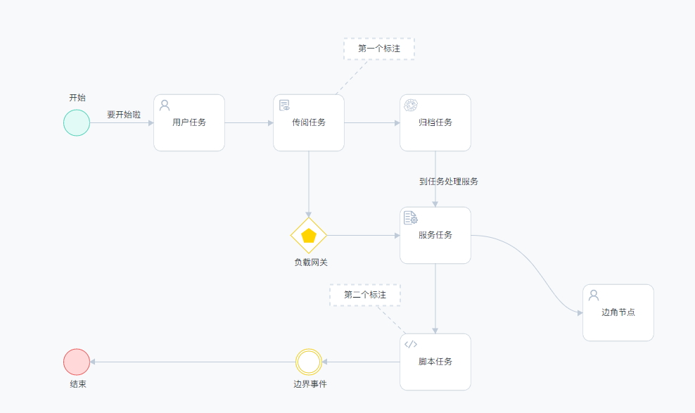
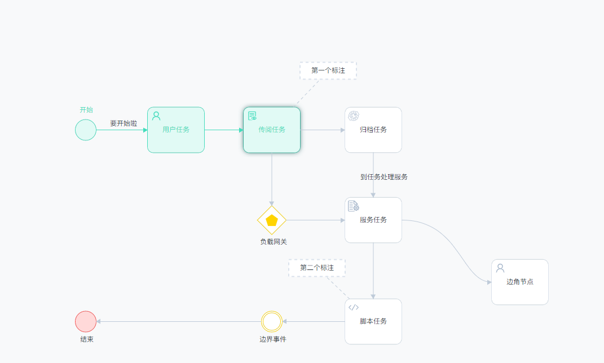
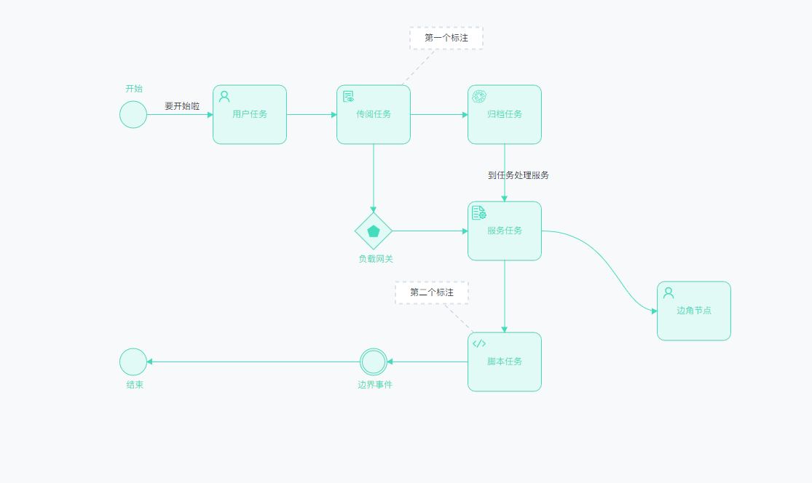

# bpmn-renderer bpmn Element custom renderer

bpmn-renderer to solve the problem of bpmn.js style modification is troublesome. The plugin provides style modifiers directly into the configuration item, which you only need to configure, and comes with a nice set of default styles.

## Document
[中文文档](./readme-zh.md)

[English document](./readme-zh.md)

## 支持

-   🎉 Node border: Border color, border thickness, border rounded corner, Shadow, shadow animation
-   🎉 Node background: Background color
-   🎉 Text: text color, text size, font
-   🎉 Connecting line: connecting line color, line thickness, arrow size
-   🎉 ICONS: Flexible icon Settings

Currently supported types: User task, Script task, Service task, text comment, dotted line connecting comment text, text label, connection line, Start node, End node, Boundary event, Gateway

## personally backing

-   🤔 Node width and height configuration
-   🤔 More task nodes

## preview

Default style: All nodes in will state
 
Default style: In ing state
 
Default style: All nodes are in over state
 

## install

    npm i bpmn-renderer

## calling method

    import Renderer from 'bpmn-renderer';

    new Viewer({
        // ...
        additionalModules: [
            Renderer({
                // Node information. You can set a state for each node. Different states use different colors
                // The ing state will have a shadow animation by default
                nodesInfo:{
                    // Each element is fixed to the following configuration, {  [元素ID]: {  status: "ing" } }
                    Gateway_0x3cmtw:{
                        // status: "ing", // "will" | "over" | "ing"
                    },
                },

                // Node styles in different states are configured using the built-in collocations by default
                // The ing and over states do not exist in the designer (node edit page).
                style: {
                    will: {
                        node: {
                            backgroundColor: "red",
                        }
                    },
                    ing:{},
                    over:{}
                }

            }),
        ],
        moddleExtensions: {
            camunda: CamundaBpmnModdle,
            qnn: qnnBpmnModdle
        }
    });

## style

Each element is divided into three states, the default being the will state (which can also be used for editing pages).

    {
        will: {
            name: "未办理",
            // task node
            node: {
                // 背景颜色
                backgroundColor: "#fff",
                // 边框颜色
                borderColor: "#dae2ec",
                // 边框圆角
                borderRadius: 10,
                // 边框粗细
                borderWidth: 2,
                // 节点文字颜色
                color: "#262c33",
                // color: "red",
                fontSize: 12,
                fontFamily: "苹方,微软雅黑",
                // 阴影大小
                boxShadowSize: 0,

                /** The node styles specified below are preferred **/
                // 开始节点特殊样式
                'bpmn:StartEvent': {
                    backgroundColor: "rgb(225, 250, 245)",
                    borderColor: "rgb(67, 220, 188)",
                },
                // 结束节点特殊样式
                'bpmn:EndEvent': {
                    backgroundColor: "rgb(255, 217, 217)",
                    borderColor: "rgb(255, 79, 79)",
                },
                // 网关
                'bpmn:ExclusiveGateway': {
                    borderColor: "#FFD400",
                },
                // 边界事件
                'bpmn:IntermediateThrowEvent': {
                    borderColor: "#FFD400",
                }
            },
            // Node connection line and arrow
            arrows: {
                // Line Width
                width: 1,
                backgroundColor: "#bfcbd9",
                // Angle connection type  "L" straight line | "C" curve,
                joinStyle: "C",
                // Arrow width and height, must be a number (unit: px)
                arrowsWidth: 12,
                arrowsHeight: 12,
            },

            icon: {
                width: 20,
                height: 20,
                color: "#a7b7cb",
                left: 5, top: 5,
                /**
                * svg ICONS for individual elements
                * Must return a '<svg>... The </svg>' string cannot contain DOCTYPE xml tags
                */
                svgs: {
                    // 用户任务
                    'bpmn:UserTask': ({ element }) => {
                        const nodeType = element.businessObject["userTaskType"];
                        return {
                            "1": chuanyue,
                            "2": guidang
                        }[nodeType] || userIcon;
                    },
                    'bpmn:ScriptTask': ({ element }) => scriptIcon,
                    'bpmn:ServiceTask': ({ element }) => fuwuliu,
                    // 网关内部小图标
                    'bpmn:ExclusiveGateway': ({ element }) => wubianxing,
                },

                /** The node styles specified below are preferred **/
                // 网关
                'bpmn:ExclusiveGateway': {
                    color: "#FFD400",
                    width: 25,
                    height: 25,
                },
            },
        },

        // 被激活后的样式
        over: {
            name: "已办理",

            // 节点
            node: {
                backgroundColor: "rgb(225, 250, 245)",
                borderColor: "rgb(67, 220, 188)",
                borderRadius: 10,
                borderWidth: 2,
                // 节点文字颜色
                color: "rgb(67, 220, 188)",
                fontSize: 12,
                fontFamily: "苹方,微软雅黑",
                // 阴影大小
                boxShadowSize: 0,

                // 开始节点特殊样式
                'bpmn:StartEvent': {
                    backgroundColor: "rgb(225, 250, 245)",
                    borderColor: "rgb(67, 220, 188)",
                },
            },
            // 节点连接线/箭头
            arrows: {
                // 线条粗细
                width: 1,
                backgroundColor: "rgb(67, 220, 188)",
                // 转角连接类型  "L" 直线 | "C" 曲线,
                joinStyle: "C",
                // 箭头宽高， 必须为数字（单位 px）
                arrowsWidth: 12,
                arrowsHeight: 12,
            },
            // 图标
            icon: {
                width: 20,
                height: 20,
                color: "rgb(67, 220, 188)",
                left: 5, top: 5,
               /**
                * svg ICONS for individual elements
                * Must return a '<svg>... The </svg>' string cannot contain DOCTYPE xml tags
                */
                svgs: {
                    // 用户任务
                    'bpmn:UserTask': ({ element }) => {
                        const nodeType = element.businessObject["userTaskType"];
                        return {
                            "1": chuanyue,
                            "2": guidang
                        }[nodeType] || userIcon;
                    },
                    'bpmn:ScriptTask': ({ element }) => scriptIcon,
                    'bpmn:ServiceTask': ({ element }) => fuwuliu,
                    // 网关内部小图标
                    'bpmn:ExclusiveGateway': ({ element }) => wubianxing,
                }
            },
        },

        // 闪烁样式
        ing: {
            name: "正在办理",

            // 节点
            node: {
                backgroundColor: "rgb(225, 250, 245)",
                borderColor: "rgb(67, 220, 188)",
                borderRadius: 10,
                borderWidth: 2,
                // 节点文字颜色
                color: "rgb(67, 220, 188)",
                fontSize: 12,
                fontFamily: "苹方,微软雅黑",
                // 阴影大小
                boxShadowSize: 0,
            },
            // 节点连接线/箭头
            arrows: {
                // 线条粗细
                width: 1,
                backgroundColor: "rgb(67, 220, 188)",
                // 转角连接类型  "L" 直线 | "C" 曲线,
                joinStyle: "C",
                // 箭头宽高， 必须为数字（单位 px）
                arrowsWidth: 12,
                arrowsHeight: 12,
            },
            // 图标
            icon: {
                width: 20,
                height: 20,
                color: "rgb(67, 220, 188)",
                left: 5, top: 5,
                /**
                * svg ICONS for individual elements
                * Must return a '<svg>... The </svg>' string cannot contain DOCTYPE xml tags
                */
                svgs: {
                    // 用户任务
                    'bpmn:UserTask': ({ element }) => {
                        const nodeType = element.businessObject["userTaskType"];
                        return {
                            "1": chuanyue,
                            "2": guidang
                        }[nodeType] || userIcon;
                    },
                    'bpmn:ScriptTask': ({ element }) => scriptIcon,
                    'bpmn:ServiceTask': ({ element }) => fuwuliu,
                    // 网关内部小图标
                    'bpmn:ExclusiveGateway': ({ element }) => wubianxing,
                }
            },
        }
    }
